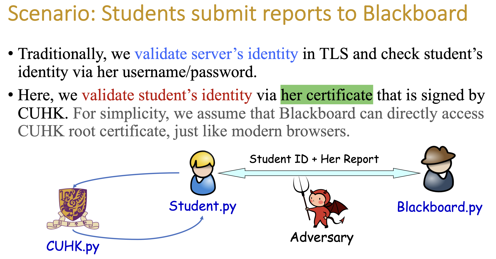
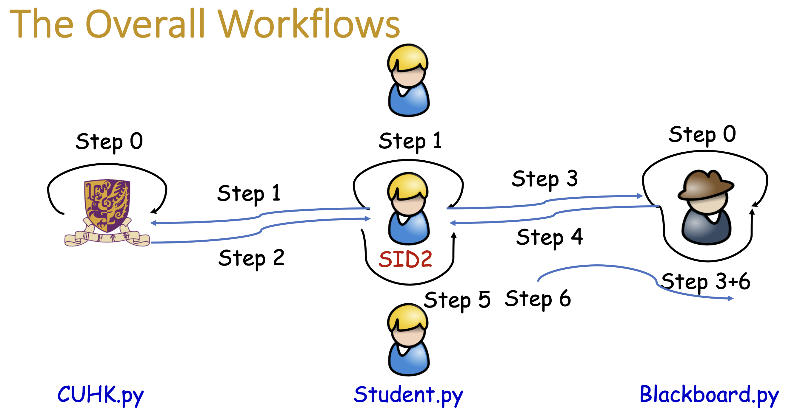
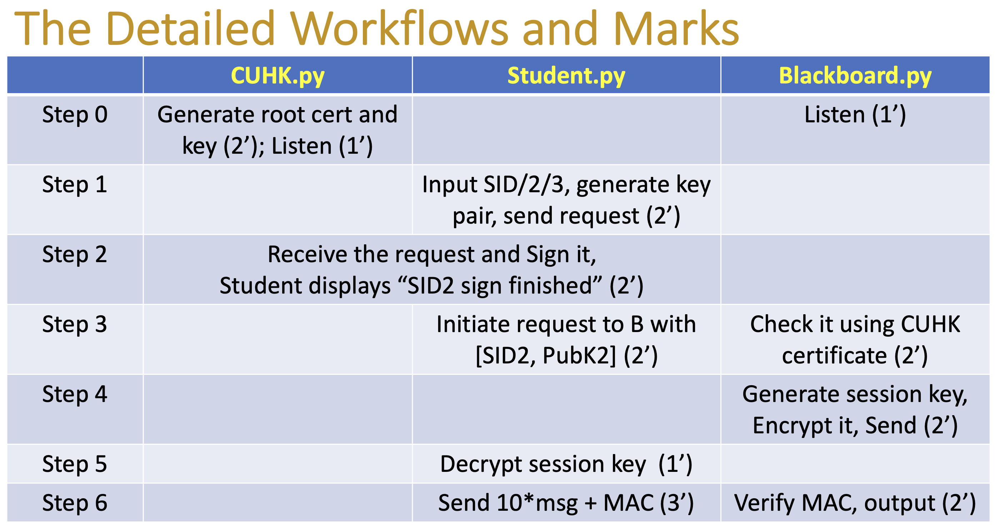

# Secured Data Communication System 
- Scenario: Students submit reports to Blackboard (CUHK IEMS5710 Project)
- :star2: **Found this repository helpful?** Light it up with a star :star2: and make my day! :wink:

---
### Contribution: 

- Crypto part:

  1. Generate key pairs,
  2. Generate certificate,
  3. Verify certificate,
  4. Export public key from certificate, 5. RSA Encryption/Decryption,
  5. AES encryption/decryption

- Socket part:

  1. CUHK.py: There is a thread for listening the socket connection request. When a new connection is established, it will launch a new thread to handle all the interation in this new connection
  2. Student.py: It is a single node with only one main thread. It will first connect to the CUHK.py, then connect to the Blackboard.py and send message to Blackboard.py.
  3. Blackboard.py: Same as CUHK.py

---
### How to setup the environment:
- Dependences(requirements.txt):
  1. python 3.9.12
  2. pycryptodome 3.15.0
  3. cryptography 3.4.8


```shell
pip install -r requirements.txt
```
### How to run:
```shell
python CUHK.py
python Blackboard.py
python Student.py -sid 001
#(python Student.py —sid xxx)
```


After issue certificate, verify certificate and delivery session key by RSA, the AES encryption/decryption channel is established.

At student side, manually input the message you'd like to send. E.g. "hello I am student 001"

- Student:
```shell
Start communicate with BlackBoard !
me: hello I am student 001
```


- Blackboard:
```shell
001: hello I am student 001
```

- Then(start a new terminal or cmd):
```shell
python Student.py -sid 002
python Student.py -sid 003
```
Exit: 
press control+c
---





### Entities:
CUHK, Blackboard, Student. After instantiation, each of them will create a root work directory. And assign a port for listening.

The message passing among CUHK.py, Student.py and Blackboard.py is implemented by Python Socket Programming.

CUHK.py: There is a thread for listening the socket connection request. When a new connection is established, it will launch a new thread to handle all the interation in this new connection

Student.py: It is a single node with only one main thread. It will first connect to the CUHK.py, then connect to the Blackboard.py and send message to Blackboard.py.

Blackboard.py: Same as CUHK.py

### Crypto function in utils.py
 1. Generate key pairs, 
 2. Generate certificate, 
 3. Verify certificate, 
 4. Export public key from certificate, 
 5. RSA Encryption/Decryption, 
 6. AES encryption/decryption


### Workflow:
Step 0
- CUHK: Generate root cert and key (2’); Listen (1’)
- Blackboard: Listen (1’)

Step 1
- Student: Input SID/2/3, generate key pair, send request

Step 2
- CUHK: Receive the request and Sign it, Student displays “SID2 sign finished” (2’)

Step 3
- Student: Initiate request to B with [SID2, PubK2] (2’)
- Blackboard: Check it using CUHK certificate (2’)

Step 4
- Blackboard: Generate session key, Encrypt it, Send (2’)

Step 5
- Student: Decrypt session key (1’)

Step 6
- Student: Send 10*msg + MAC (3’)
- Blackboard: Verify MAC, output (2’)


### Reference:

1. https://www.pycryptodome.org
2. https://cryptography.io/en/latest/
3. https://docs.python.org/3/library/socket.html

Generate key pairs, RSA, AES refer sample on pycryptodome documentation (https://pycryptodome.readthedocs.io/en/latest/src/public_key/rsa.html).
 Generate certificate refer (https://cryptography.io/en/latest/)
 The message passing among CUHK.py, Student.py and Blackboard.py is implemented by Python Socket Programming.

---
- :star2: **Found this repository helpful?** Light it up with a star :star2: and make my day! :wink:
